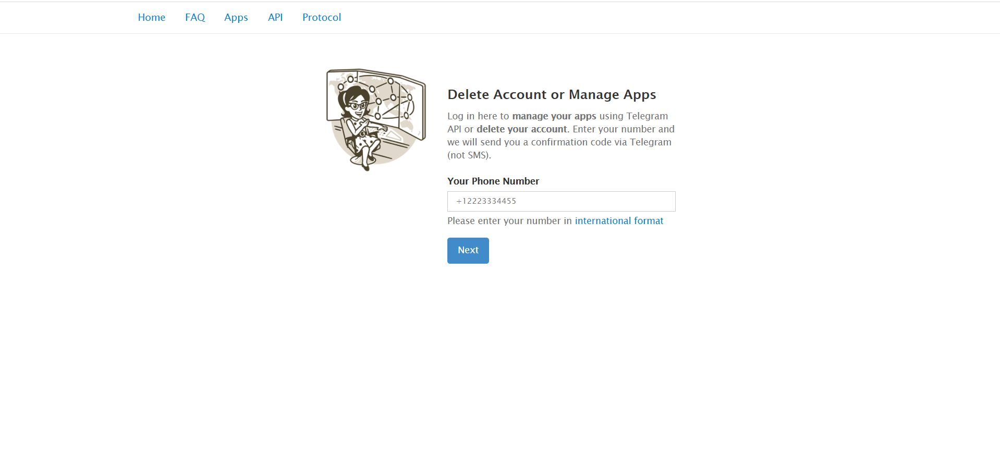
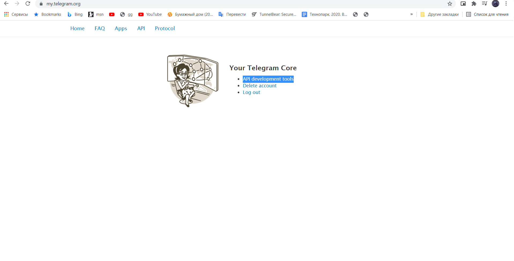
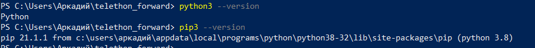

### 1 STEP
1)Зайти https://my.telegram.org/auth

2)Выбрать API development tools

3)Создать приложение заполнив первые 2 поля(App title и Short name)

4)Запомнить App api_id и App api_hash

### 2 STEP
1)Установить python https://www.python.org/downloads/

2)Открыть Power Shell(набрать в поиск) с правами администратора 

3)Проверить что установилось (PowerShell)

Команды:

python3 --version

pip3 --version

4)Установить telethon (PowerShell)

Команды:

python3 -m pip install --upgrade pip

python3 -m pip install --upgrade telethon

### 3 STEP
1)Скопировать код из forward.py в блокнот и сохранить в удобное место

2)Перейти через Power Shell в место куда сохранил

cd <Название деректории> - перейти в <Название деректории>

cd .. - назад

3)Запустить скрипт (PowerShell)

Команда:

python forward.py

4)Следовать инструкции в приложении